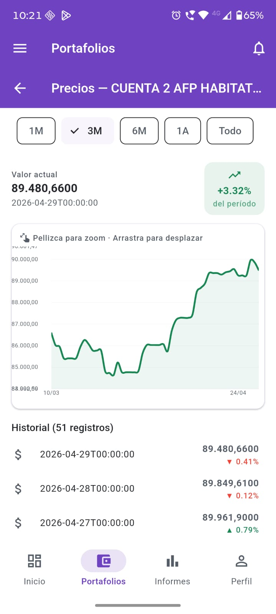
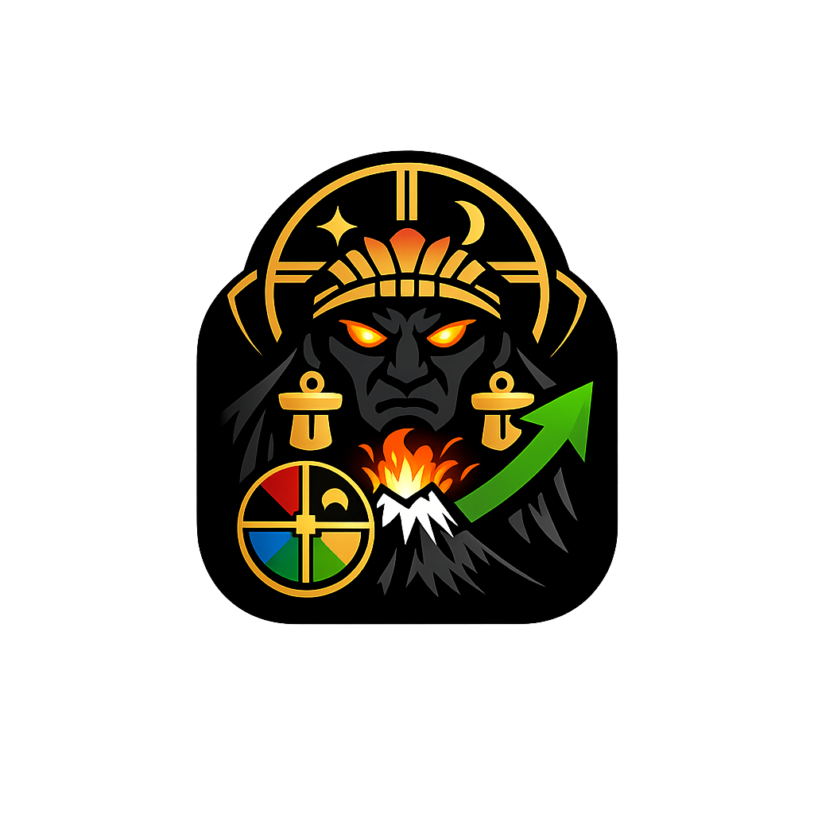

# 📱 PillanTrack

Aplicación móvil desarrollada en **Flutter** para la consulta de portafolios y fondos de inversión, con un enfoque en **seguridad, simplicidad y transparencia**.

---

## 🚀 Descripción breve
PillanTrack es una app financiera que permite a los usuarios consultar sus portafolios y fondos de inversión de manera segura, sin requerir permisos adicionales en el dispositivo.

---

## 📖 Descripción completa
PillanTrack es la versión móvil del sistema de consultas de portafolios y fondos.  
Su objetivo es ofrecer una experiencia ágil y confiable para revisar información financiera desde dispositivos Android e iOS.

---

## 🏛️ Arquitectura

### 📱 Frontend Móvil (APK)
- **Framework:** Flutter 3.x / Dart  
- **Gestión de estado:** Riverpod 2  
- **Navegación:** GoRouter  
- **Visualización:** fl_chart para gráficos interactivos  
- **Almacenamiento seguro:** para credenciales  

### 🌐 Frontend Web (React)
Este proyecto fue inicializado con [Create React App](https://github.com/facebook/create-react-app).

#### Recursos
- [Documentación Create React App](https://facebook.github.io/create-react-app/docs/getting-started)  
- [Documentación React](https://reactjs.org/)  

### ⚙️ Backend
- **Lenguaje:** Python (FastAPI)  
- **Autenticación:** JWT con refresh tokens  
- **Gestión de secretos:** Variables de entorno / Secret Manager  
- **Pool de conexiones:** Oracle Instant Client dedicado para la app móvil  
- **Seguridad de endpoints:** HTTPS obligatorio, validación de entrada, rate limiting  

### 🔗 Comunicación
- El APK y el frontend React consumen **endpoints REST** del backend.  
- El backend gestiona credenciales de BD y lógica de negocio.  
- Tokens de acceso y refresh garantizan sesiones seguras y renovables.  

---

## 🛡️ Seguridad

- **APK sin credenciales sensibles**: nunca contiene usuario/contraseña de BD.  
- **Endpoints protegidos**: autenticación fuerte (OAuth2/JWT).  
- **TLS obligatorio**: todas las conexiones cifradas.  
- **Roles mínimos en BD**: usuario de servicio con permisos limitados.  
- **Monitoreo y alertas**: auditoría de accesos y métricas de pool de conexiones.  
- **Rotación de credenciales**: gestionada en backend/secret manager.  

---

## 🗄️ Base de Datos

- **Motor:** Oracle Database  (en OracleCloud)
- **Conexión:** Pool dedicado para la app móvil  
- **Gestión de usuarios:**  
  - Usuario de servicio con permisos mínimos (solo lectura de portafolios y fondos).  
- **Optimización:**  
  - Índices en tablas de portafolios y fondos.  
  - Consultas parametrizadas para evitar inyecciones.  
- **Seguridad:**  
  - Credenciales almacenadas en gestor seguro.  
  - Nunca expuestas en código fuente ni en el APK.  

---

## 📊 Gráfico de funciones
  
*Consulta portafolios y fondos de inversión con seguridad.*

---

## 🖼️ Icono de la aplicación
  
*Diseño inspirado en Pillan, entidad mapuche protectora, combinado con símbolos financieros.*

---

## 🧪 Testing en Google Play
Para pruebas internas y cerradas en **Google Play Console**:
1. Ir a **Informe previo al lanzamiento → Ajustes → Credenciales de la cuenta de prueba**.  
2. Ingresar usuario y contraseña de prueba (cuenta dedicada).  
3. Guardar cambios y compartir credenciales con los testers.  

---

## 📦 Publicación
- **Formato APK/AAB:** Generado en modo release.  
- **Icono:** PNG 512x512 px, < 1 MB.  
- **Gráfico de funciones:** PNG 1024x500 px, < 15 MB.  
- **Política de privacidad:** `privacy.md` incluida en el repositorio.  

---

## 👤 Autor
**Roberto Escobar**  
- Ingeniero en Ejecución en Informática  
- App Developer & Cloud Engineer (OCI, FastAPI, Flutter)  
- 
- 📧 roberto.escobar.wall@gmail.com  

---

## ✅ Estado
- Implementación: **Completada**  
- Testing: **En curso (14 días, 12 testers)**  
- Publicación: **Pendiente en Google Play Console**
